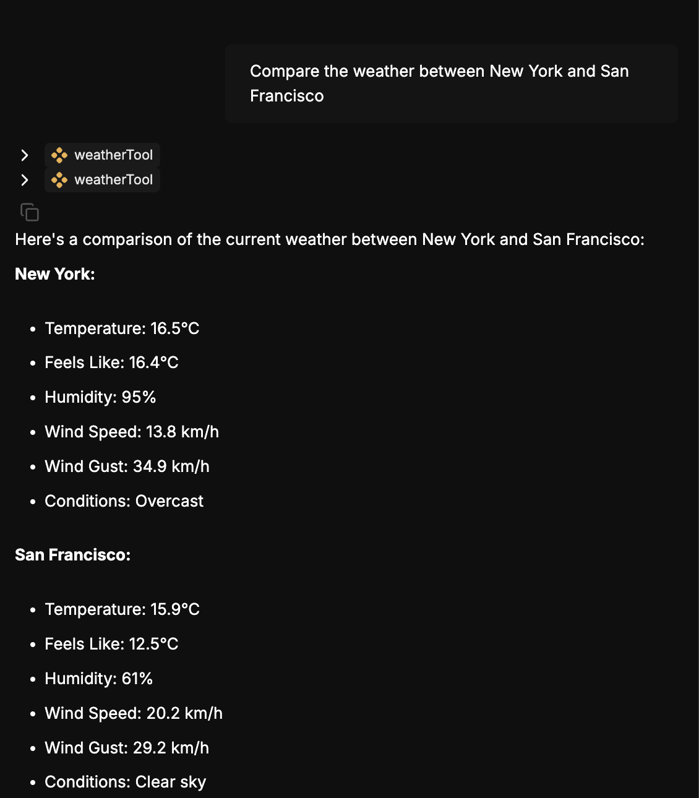
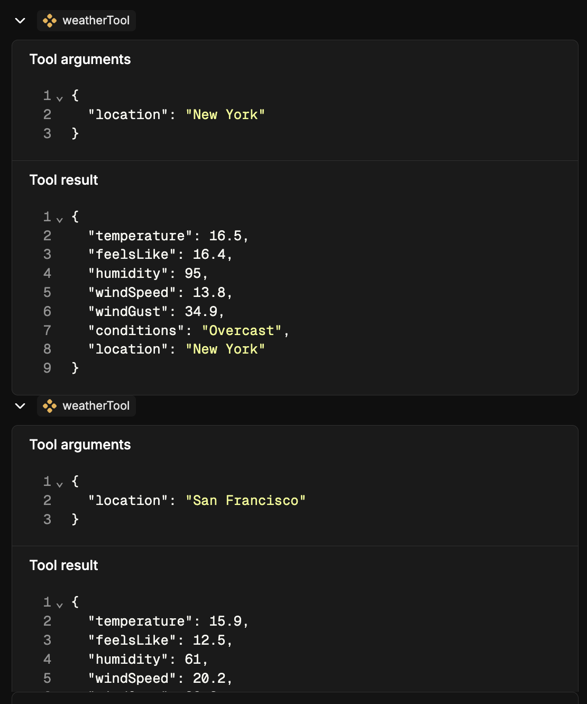
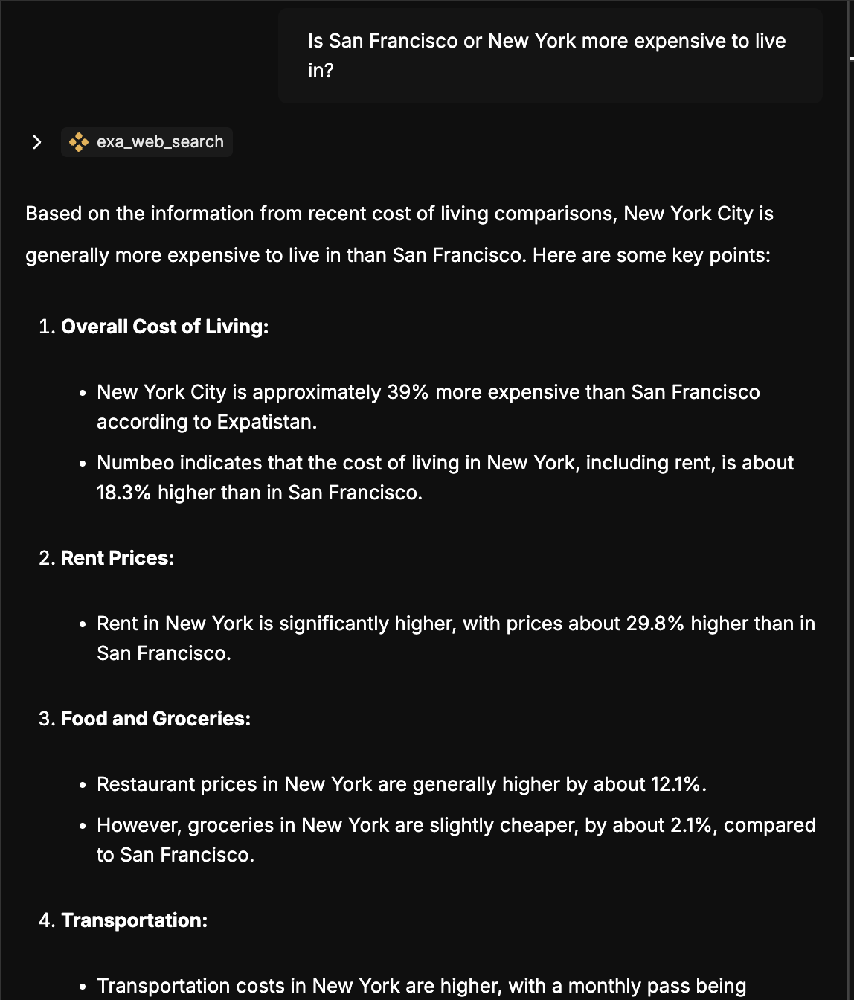
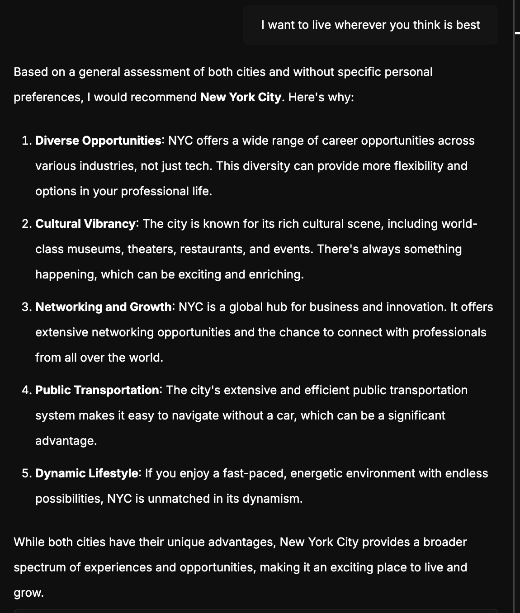
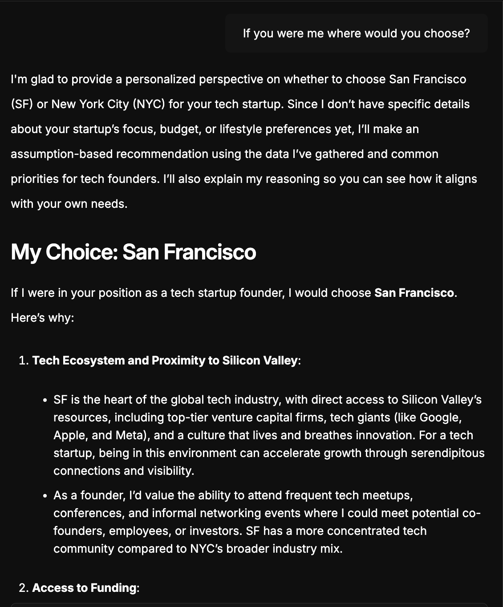

# Single AI Agent - Move Planner
This agent helps you decide if you should move to NYC or SF

## Tools
### web_search
This is from the Exa Search MCP server
https://smithery.ai/server/exa

This will research the web for you and return the most relevant results scrapped from the web

### weatherTool
This tool comes preloaded with Mastra if you run `npm create mastra` and tell it to load example agents and tools.
This tool uses a couple of API calls to get location and weather data.

## System Prompt
You are a helpful assistant that helps tech startup founders decide to move to either New York City or San Francisco. 
You can use the web_search tool to get information on cost of living.

## Example Run
I asked it about the weather and you can see it used the weatherTool

Mastra shows you what the weatherTool returned if you expand the results.

I asked it about the cost of living and time is uses the web_search tool from the Exa Search MCP server

When I expanded the results I saw web_search scraped the url: https://www.expatistan.com/cost-of-living/comparison/san-francisco/new-york-city

Finally, after multiple rounds of asking the agent to decide for me I bullied it into making a decision:
I asked it about the weather and you can see it used the weatherTool

I asked Grok to decide and it immediately used both tools right off the bat and decided SF whereas gpt-4o decided NYC.
